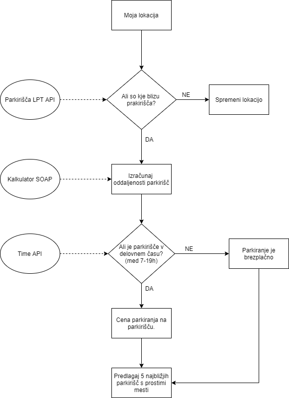

# Internet of Things and smart environments

## Main problem

The basic goal of smart environments (smart home, factories, city, energy, community, ...) is to improve life / business / user experience based on smart solutions, which we achieve by connecting ICT and Internet of Things (IoT). The latter is based on the interconnection of devices with built-in sensors and their remote control.

If we connect the services of individual devices into larger, composite services, we create added value.

## Idea

We travel a lot these days. We usually want to park as close as possible to nearby locations. The idea is to get information about the nearest parking lots regarding the user's location from the parking data. Information on occupancy and the price of the car park at the current time is also important for users.

Solution for obtaining data on parking lots for Ljubljana. To calculate the distance of the parking lot, the air distance and the curvature of the Earth according to Haversin's formula are taken into account. From the data on parking lots, we obtain the location of the parking lot and data on parking prices per hour. To check the parking hours of the WorldTime API user, we can enable obtaining a local date in the parking lot, so we can check if the local parking time is between 7pm and 7am and parking is free.

## Diagram

  

